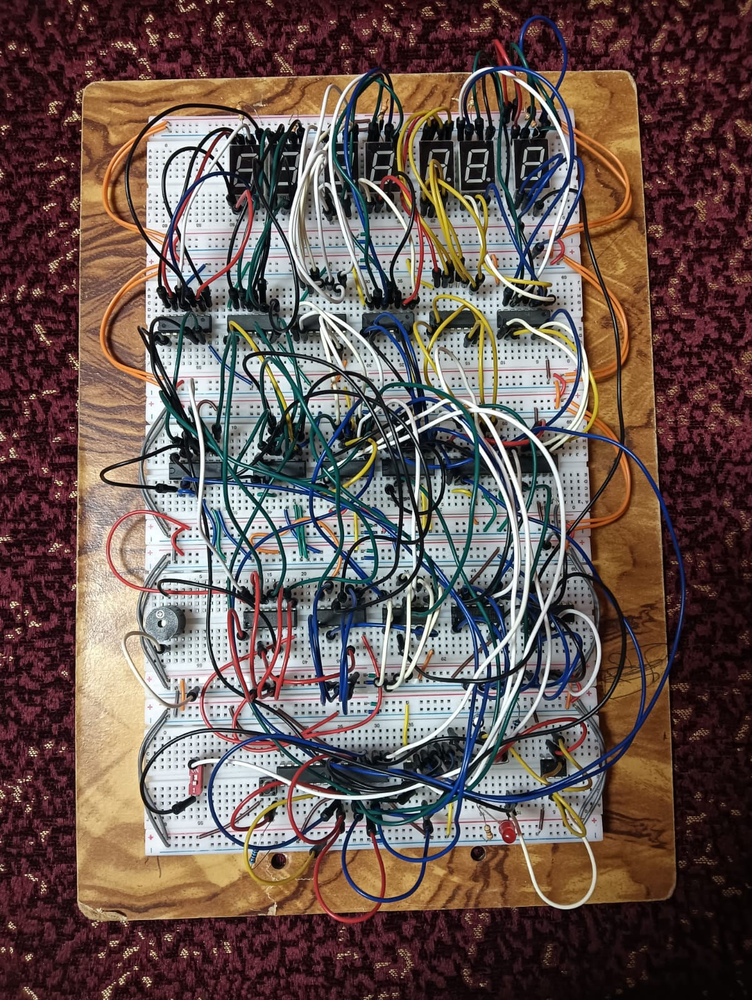

# Digital Clock – Logic Design Project

## 📌 Project Overview
This project is a **12-hour digital clock** designed as part of the **Second Year Computer Science – Logic Design course**.  
The clock displays time in **hours, minutes, and seconds**, includes an **AM/PM indicator**, and supports both a **stopwatch** and an **alarm**.

The system is implemented using fundamental **digital logic components**, focusing on counters, timers, and control logic.

---

## ⏰ Features
- 12-hour time format
- AM / PM indicator
- Stopwatch functionality
- Alarm with alert signal
- Start / Stop control
- Reset functionality

---

## 🧠 Concepts Used
- Digital counters
- Flip-flops
- Logic gates
- Timer (555 timer or clock pulse source)
- Frequency division
- Control and reset logic

---

## 🛠️ Tools & Technologies
- Logic Design principles
- Simulation software (Proteus)
- Breadboards
- Counters
- Decoders
- 7-segment displays
- 4-bit magnitude Comparators
- Timer
- Switch and push button
- Wires and Resistors 

---

## ▶️ How It Works
- A timer circuit generates clock pulses.
- Counters increment seconds, minutes, and hours.
- Logic controls switch between AM and PM.
- Stopwatch mode uses controlled pulse input.
- Alarm compares the current time with a preset value and triggers an output.

---
## 📝 Notes
- The clock counts from **00:00:00 to 11:59:59**.
- After reaching **11:59:59**, the clock resets to **00:00:00**.
- Therefore, **12:00:00 is represented as 00:00:00** in this design.

---

## 📷 Project Media

---

## 📁 Project Files
This repository includes:
- **Proteus simulation file** of the digital clock circuit
- **Project report (PDF)** explaining the design, components, and operation
